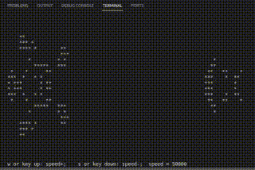

## Компиляция и запуск

Может понадобиться дополнительная установка библиотеки ncurses (команда *brew install ncurses*).

*make*

## Выбор стартового поля игры

Введите цифру *"1"*, *"2"*, *"3"*, *"4"* или *"5"* и нажмите Enter.

## Управление

Изменять скорость можно с помощью кнопок *"w"* или *"↑"* (увеличить скорость), *"s"* или *"↓"* (уменьшить скорость). Чтобы выйти из игры, нажмите *"q"* или *"^C"*.
